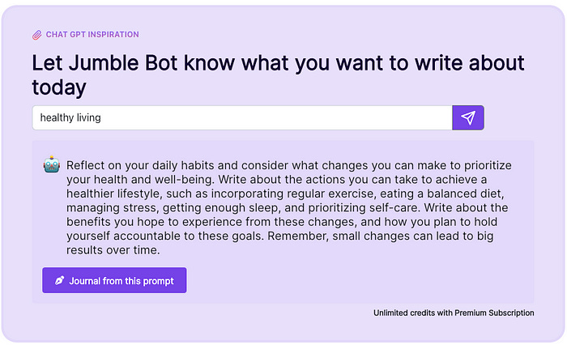

The benefits of **daily introspective journaling** are immense. This article explores how Large Language Models \(LLMs\) can enhance the benefits of journaling.

**Daily Introspective Journaling** : _A daily journaling ritual in which one writes in a stream of consciousness for a set number or pages or duration. Typically, journaling is done at the same time each day, in order to ingrain the practice as a habit._

The benefits of journaling are most akin to those of meditation and therapy. They include improvement in narrative thinking, communication, clarity, tranquility, and problem solving.

# **How LLM's Can Enhance Journaling**

## **Individualised Writing Prompt**

A second possibility enabled by LLM’s is a journaling assistant. This experience is similar to speaking with a therapist. The journaling assistant has memory of your past journal entries and a knowledge of modern therapeutic research and best practices. An LLM powered journaling assistant can help guide your thinking as you navigate life challenges. Conversation forces us to grapple with perspectives we would not consider in isolation. For example, a therapist will typically ask leading questions to help you see a situation more clearly. An LLM powered journaling assistant makes this possible in the comfort of home at a cost much lower than hiring a real therapist.

LLM’s bring a whole new dynamic to reviewing past journaling. In my old journals I would tag every entry, re-read every entry, highlighting important insights, then feed it all into a custom program to make it all searchable by topic over time. This was tedious to do but the benefits had been invaluable to me. The review process was responsible for much of my growth and achievements.

  * _What do I worry about most often?_

  * _What am I excited about?_

  * _What goals have I achieved this year?_

  * _What intentions remain unresolved?_

The more journal entries we have, the more value in this functionality.

Follow Jumble on [Twitter](https://twitter.com/JumbleJournal), join our [Discord](https://discord.gg/btDbh445), or [Create an account](https://jumblejournal.org/).

Originally published on [Substack](https://tonyoreglia.substack.com/p/how-ai-can-enhance-daily-journaling)
