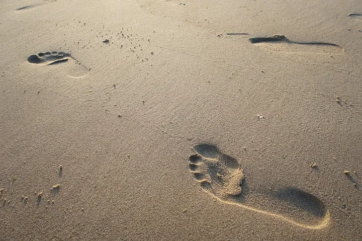

# WHAT IS LOCATION BASED SOCIAL NETWORKING
Location Based Social Networking is a new approach to online networking. The idea is that the connections and interactions between users are based on creating virtual data that is tied to a specific location. In the most simple example, a user can store a message in a specific location in virtual reality. A Location Based Social Network would then allow other users to “find” this message by arriving at that same location. The information does not exist in the real world; it is only the application that these messages can be created and found.

# WHAT IS THE POTENTIAL FOR LOCATION BASED SOCIAL NETWORKS
The potential for this type of networking are vast and already there are a number of applications on the market experimenting with this concept. Notably, [Pokémon GO](https://pokemongo.com/en) enables users to find Pokémon out in the real world via augmented reality seen through the phone. Others, like [Wallame](https://en.wikipedia.org/wiki/WallaMe), provide a platform to create virtual graffiti.

Like all technologies, augmented reality will become cheaper and less obtrusive as time goes on. It is likely that, as augmented reality becomes more accessible it will find it’s way into [every aspect of our lives](https://www.scirp.org/html/40277.html). If this is the case; we will see every type of media being tied to specific locations, landmarks and surfaces within competing augmented realities. This includes images, [drawings](https://en.wikipedia.org/wiki/Virtual_graffiti), videos, business reviews, advertisements, city tours, location triggered alarms/notifications/reminders, performing arts and more. It’s a layer on top of the real world. Given that a location can hold media over a long period of time, these applications can offer users the opportunity to explore the history of a given place.

This is why I was so excited to build “Breadcrumbs”. My own spatial data server that can support a range of location based networking applications.

# TECHNICAL DETAILS
## BUILDING THE BREADCRUMBS BACKEND
Breadcrumbs is a RESTful HTTP spatial server written in Golang. This API allows users to generate and retrieve location based textual messages. A PostgreSQL database is run in a Docker container. PostGIs is used for storage and efficient retrieval of spatial data.

### TECH STACK
- [Go Programming Language](https://go.dev/): Go is an open source programming language that makes it easy to build simple, reliable, and efficient software.
- [PostgreSQL](https://www.postgresql.org/): PostgreSQL is a powerful, open source object-relational database system.
- [PostGIs](https://postgis.net/): A spatial database extender for PostgreSQL
- [Docker](https://www.docker.com/): Docker uses OS-level virtualization to deliver software in packages called containers.
- [Flyway](https://www.red-gate.com/products/flyway/community/): Flyway is an open-source database migration tool.
- [modd](https://github.com/cortesi/modd): A flexible developer tool that runs processes and responds to filesystem changes
- [Nginx](https://www.f5.com/go/product/welcome-to-nginx): open source software for web serving.

## PRIMARY CHALLENGES
The primary challenge of serving spatial data is maintaining performance and flexibility as the data set expands. And actually these two challenges are linked. Spatial data requires a lot of math to reason about. For example, determining all of the points within a rectangle bounded by two longitudinal array and two latitudinal — if this box is the size of Portugal, the naive solution starts to break down and the math must take into account the curved surface of the planet to maintain accuracy. Thus, as the application demands more flexibility, performance is directly impacted.

This is why I chose PostGIs. PostGIs adds spatial functions such as distance, area, union, intersection, and specialty geometry data types to PostgreSQL. Spatial data types like point, line and plane are first class citizens and spatial functions, posed in SQL, are available for querying of spatial properties and relationships. PostGIS is an industry standard tool and can be used to achieve optimal performance in serving spatial data.

## BUILDING THE BREADCRUMBS FRONTEND DEMO — USING GOOGLE MAPS API WITH REACT

The Breadcrumbs frontend demo is a React component utilizing the [Google Maps API](https://developers.google.com/maps/) for displaying location based data. The demo allows people visiting the website to write a message at their devices current location; and see past messages written by any other users of the demo. The created data is stored and served using the Breadcrumbs Server described above.

The demo connects over https to the Breadcrumbs Server hosted on my local server behind Nginx. Currently, the demo support storing and retrieving textual data.

### TECH STACK
- [Google Maps API](https://developers.google.com/maps/): Exposes the latest Maps, Routes, and Places features from Google Maps Platform.
- [BreadCrumbs Server](https://github.com/tonyOreglia/breadcrumbs): a RESTful HTTP spatial server written in Golang.
- [google-map-react](https://github.com/google-map-react/google-map-react#readme): a component written over a small set of the Google Maps API.
- [Supercluster](https://github.com/mapbox/supercluster#readme): A very fast JavaScript library for geospatial point clustering for browsers and Node.
- [axios](https://github.com/axios/axios): Promise based HTTP client for the browser and node.js.
- [material-ui](https://mui.com/material-ui/): React UI components for faster and easier web development.
- [react-router-dom](https://github.com/remix-run/react-router#readme): Declarative routing for React.