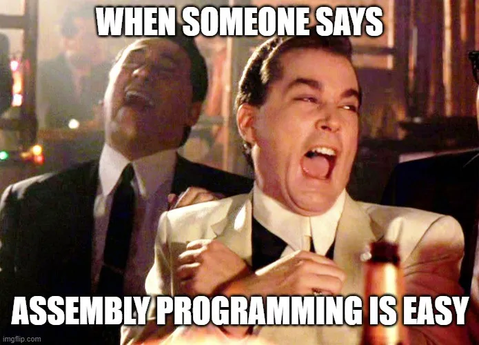
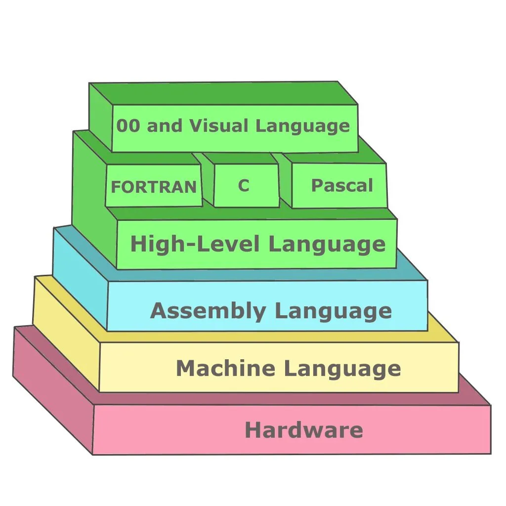

### This guide is part one of a series
- Part two: Getting Started Writing Assembly Language
- Part three: Printing Command Line Arguments
- Part four: Sending Function Arguments and Receiving a Return Value
- Part five: Conditionals, Jumping, and Looping
- Part six: How to Determine String Length
- Part seven: Quick Reference

---

This is a guide to setting up a low friction development environment to simplify writing and debugging assembly language programs.

# Why Learn Assembly Language

> He who hasn’t hacked assembly language as a youth has no heart

Learning assembly language improves one's foundational understanding of software. With improved fundamentals, you can judge the utility of upcoming technologies more accurately which I think is a super important skill set. Making the right bets on which technologies come to dominate means you can more optimally invest your time and even money. For example, it’s well known that those with a fundamental understanding of the cryptocurrency space immediately understood the value of blockchain and literally made millions of dollars with nearly no additional effort.

Also, assembly language it’s close to the hardware, and that’s fun.



# Some Background

To run an assembly language program, first, the compiler creates an object code file (.obj). Next, the object code file must be linked into an executable. Linking can be done with the compiler or a separate linker process.

# Preparation

Getting prepared to write assembly language can be a bit confusing. There are a number of tools that can compile and link assembly. It may not be obvious which tools work on a given operating system, which supports compiling to a machine binary that is compatible with a given processor and is compatible with debugging software. I tried a number of options around compiling, linking, and debugging before finding a solution that worked well. Some of the tools I experimented with are

- [GNU Compiler Collection (GCC)](https://gcc.gnu.org/onlinedocs/gcc/Invoking-GCC.html): an integrated distribution of compilers for several major programming languages.
- [g++](https://linux.die.net/man/1/g++): GNU project C and C++ compiler
- [The Netwide Assembler (NASM)](https://www.nasm.us/doc/nasmdoc1.html#section-1.1): assembler designed for portability and modularity. Supports [80x86](https://en.wikipedia.org/wiki/X86) and [x86–64](https://en.wikipedia.org/wiki/X86-64) (families of processors supporting specific instruction sets)
- [yasm](https://www.tortall.net/projects/yasm/manual/html/manual.html): assembler that is designed to allow for multiple assembler syntaxes to be supported.
- [ld](https://ftp.gnu.org/old-gnu/Manuals/ld-2.9.1/html_node/ld_3.html): combines a number of object and archive files, relocates their data and ties up symbol references. Usually, the last step in compiling a program is to run ld.
- [GNU Project debugger (gdb)](https://www.sourceware.org/gdb/): allows you to see what is going on `inside’ another program while it executes
[clang](https://clang.llvm.org/get_started.html): GCC-compatible compiler driver


I started with clang but had trouble getting the linked executable to run.

Next, I tried a combination of NASM to compile and ld to link the object file. For example,

```bash
$ nasm -f macho64 -o hello_world.o hello_world.asm
$ ld hello_world.o -o hw
$ ./hw
```

This works well on a Mac until you need to debug. gdb is not able to step through a file linked from a macho64 object file. This [blog post](https://lord.io/gdb-on-osx/) details a similar ordeal. Unfortunately,NASM does not support the required macho debug format yet.

The blog linked above suggested using a virtual machine to run Linux whose supported assembly language formats have support for debugging via NASM. However, running a VM is quite heavy and a simple docker container should do the job.

# TLDR; How to use GDB within a Docker Container

This [Dockerfile](https://github.com/tonyOreglia/argument-counter/blob/master/Dockerfile) supports compiling x86–64 assembly code using `NASM`, linking with `gcc` (or `ld`) and debugging with `gdb`.

The Docker container must be run with the options `--cap-add=SYS_PTRACE` and `--security-opt seccomp=unconfined` in order for `gdb` to be fully functional:

```bash
$ docker run --rm -it --cap-add=SYS_PTRACE --security-opt seccomp=unconfined -v "$(current_dir)":/app -w /app <DOCKER-IMAGE-NAME>
```


# Getting to the Above Command

I initially decided to compile, link and debug the assembly code program within a Linux docker container to enable debugging options not supported on Mac OS.

However, despite getting all of this setup, `gdb` was still failing to break during execution. It was reporting the following error:

```
warning: Error disabling address space randomization: Operation not permitted
Sounds like gdb needs control over addressing space, but Docker is not permitting this control.
```

# How to Fix This

The suggestion found on [Stack Overflow](https://stackoverflow.com/questions/35860527/warning-error-disabling-address-space-randomization-operation-not-permitted) is to run Docker with the following options:

```bash
docker run --cap-add=SYS_PTRACE --security-opt seccomp=unconfined
```

Sure enough, including these options seemed to sort out `gdb`. Using these commands to run the Docker container shell, then using `gdb` enables `gdb` breakpoints to work:

```bash
(gdb) disass _start
Dump of assembler code for function _start:
   0x00000000004000b0 <+0>:     mov    $0x1,%eax
   0x00000000004000b5 <+5>:     mov    $0x1,%edi
   0x00000000004000ba <+10>:    movabs $0x6000d8,%rsi
   0x00000000004000c4 <+20>:    mov    $0xe,%edx
   0x00000000004000c9 <+25>:    syscall
   0x00000000004000cb <+27>:    mov    $0x3c,%eax
   0x00000000004000d0 <+32>:    xor    %rdi,%rdi
   0x00000000004000d3 <+35>:    syscall
End of assembler dump.
(gdb) break *0x4000b0
Breakpoint 1 at 0x4000b0: file hellow.asm, line 8.
(gdb) run
Starting program: /app/hw
Breakpoint 1, _start () at hellow.asm:8
8         mov rax, 1
(gdb)
```

Unfortunately, there still seemed to be a problem. When attempting to step through a program, I was getting strange behavior:

```bash
Breakpoint 1, 0x0000000000400110 in _start ()
(gdb) s
Single stepping until exit from function _start,
which has no line number information.
```

I could not single-step through the function _start.

After some digging, I found the reason for this strange behavior. It says [here](https://docs.docker.com/engine/security/seccomp/) that `seccomp` profiles require `seccomp 2.2.1` which is not available on Ubuntu 14.04, Debian Wheezy, or Debian Jessie. Since the initial Docker base image used was [Debian Jessie](https://github.com/tonyOreglia/argument-counter/blob/master/Dockerfile#L1), the `seccomp` option was having no effect.

To resolve this issue the [base image](https://github.com/tonyOreglia/argument-counter/blob/master/Dockerfile) was switched to Alpine Linux which supports seccomp 2.2.1. This worked great. See the [Makefile](https://github.com/tonyOreglia/argument-counter/blob/master/Makefile) here regarding how to build, run and debug within this type of Docker container.

# Let’s Dig Deeper

## Explanation of Arguments

```bash
docker run --cap-add=SYS_PTRACE --security-opt seccomp=unconfined
```

…What are `cap-add` and `security-opt` actually, doing?

## cap-add

From [Docker Reference](https://docs.docker.com/engine/containers/run/#operator-exclusive-options), the `--cap-add` option allows the user to add Linux capabilities. The option `SYS_PTRACE` enables tracing arbitrary processes using ptrace(2).

Finally, from the [Linux man page of ptrace](https://www.systutorials.com/docs/linux/man/2-ptrace/):

```
The ptrace() system call provides a means by which one process (the "tracer") may observe and control the execution of another process (the "tracee"), and examine and change the tracee's memory and registers. It is primarily used to implement breakpoint debugging and system call tracing.
```

OK. This makes sense. GDB needs to use ptrace to set breakpoints, but by default, Docker doesn’t allow the capability.

## security-opt seccomp=unconfined

In regards to the other recommended option (`--security-opt seccomp=unconfined`), after a little digging, I found that you can override the default labeling scheme for each container by specifying the `--security-opt` flag. See [here](https://docs.docker.com/engine/containers/run/#security-configuration).

What is a labeling scheme in Docker?

Docker labels are a mechanism for applying metadata to Docker objects, including:

- Images
- Containers
- Local daemons
- Volumes
- Networks
- Swarm nodes
- Swarm services
  
For more information about using GDB to debug assembly code, see [here](https://web.cecs.pdx.edu/~apt/cs491/gdb.pdf) and [here](https://www.cs.swarthmore.edu/~newhall/cs31/resources/ia32_gdb.php). 

# Using Docker to Compile, Link, Run, and Debug Assembly Language Code

See the [Makefile](https://github.com/tonyOreglia/argument-counter/blob/master/Makefile) for commands that compile, link, run and debug assembly code on a Docker container. Copied below for convenience:

## Build and Link Assembly

```bash
docker run --rm -v $(current_dir):/app -w /app linux-assembly sh -c "nasm -f elf64 -F dwarf -g $(asm).asm && ld -m elf_x86_64 $(asm).o"
```

## Run Executable

```bash
docker run --rm -v "$(current_dir)":/app -w /app linux-assembly sh -c "./a.out"
```

## Debug

```bash
docker run --rm -it --cap-add=SYS_PTRACE --security-opt seccomp=unconfined -v "$(current_dir)":/app -w /app linux-assembly sh -c "gdb a.out"
```

# Figuring out an Efficient Development Cycle
Now that I’ve figured out how to get GDB working properly within Docker, the next step is to find an efficient development cycle.

I prefer to develop using [VS Code](https://code.visualstudio.com/) rather than something like `vim` while connected to a Docker container. The question is how to develop locally on VS Code and then quickly compile, link, and run (in debug mode) the code on the docker container that is now set up?


