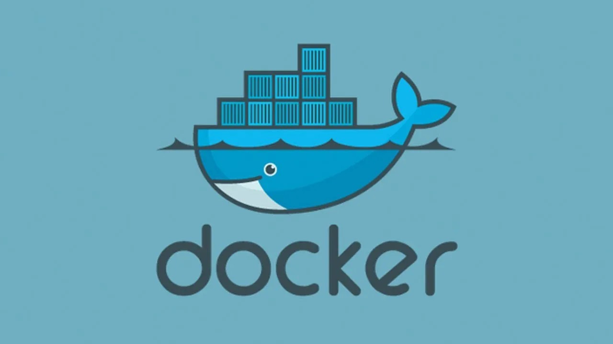
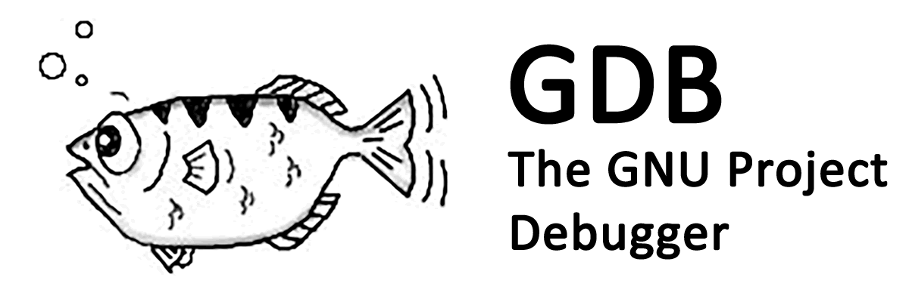

This guide is part two of a [series](https://tonycodes.com/blog/series/writing-an-x8664-assembly-language-program/).

--- 

Now that GDB is working well with Docker, the next step is to find a development cycle that enables you to quickly run code and debug it if needed.

I prefer to develop within [VS Code](https://code.visualstudio.com/) rather than having to develop directly on the Docker container with `vim`. The question is how to develop on VS Code, then quickly compile, link, run and debug the code on the docker container that is now set up?


The answer came from this helpful [blog post](https://medium.com/better-programming/why-and-how-to-use-docker-for-development-a156c1de3b24). This blog post provides a useful starting point regarding how to leverage an image to build an executable, then run another container to run the executable. Although it does not cover assembly language, it is exactly the sort of workflow we need to use.

The blog post suggests a command like this to handle a build or compiling step.

```bash
docker run --rm -v "$(pwd)":/app -w /app iron/node:dev sh -c 'npm install'
```

But the post does not describe what each of these options does, so let’s break it down for those of use that are not proficient with Docker. Note that this is just an example command to demonstrate how Docker can be used to run a build step.

# Break Down of Docker Command Line Arguments

**Clean Up**

```bash
--rm
```

This is just a build step. The container does not need to be up and running once it’s been used to prepare the executable. This flag tells Docker to tear down the container once it’s finished. See Docker’s documentation here.

**VOLUME (shared filesystems)**

```bash
-v “$(pwd)”:/app
```

The artifact from the build step should be saved. This option creates a Docker volume that persists in the local directory after the Docker container is torn down. See Docker’s documentation [here](https://docs.docker.com/engine/containers/run/#volume-shared-filesystems).

**WORKDIR**

```bash
-w /app
```

Override the working directory that is defined in the base image. See Docker’s documentation [here](https://docs.docker.com/engine/containers/run/#workdir).

**Base Docker Image**

```bash
iron/node:dev 
```

Base Docker image to use for the build. Find the iron/node image [here](https://hub.docker.com/r/iron/node). This image was created by [iron.io](https://www.iron.io/) and is essentially a small image with node installed.

**Command to run within Docker**

```bash
sh -c ‘npm install’ 
```

Override command from Docker image. This is the build step that we want to run.

**Compiling, Linking, and Debugging on Docker**

Now that we understand those pieces, let’s apply it to our Assembly Language program. After building an image named linux-assembly by running the following from the directory containing the [Dockerfile](https://github.com/tonyOreglia/argument-counter/blob/master/Dockerfile):

```bash
docker build -t linux-assembly .
```

The assembly code can be compiled and linked with the following command, using the same arguments outlined above.

```bash
docker run --rm -v "$(pwd)":/app -w /app linux-assembly sh -c "nasm -f elf64 -F dwarf -g hellow.asm && ld -m elf_x86_64 -o hw hellow.o"
```

This produces an executable file (hw) in the local directory. Note that this executable is in elf64 format which will not run on a Mac operating system. It can however, be run on the same Docker image with the command:

```bash
docker run --rm -v "$(pwd)":/app -w /app linux-assembly sh -c "./hw"
```

Finally, debugging can be done directly on the Docker container with the command:

```bash
docker run --rm -it --cap-add=SYS_PTRACE -v "$(pwd)":/app -w /app linux-assembly sh -c "gdb hw"
```



Now you can develop locally using VSCode and quickly run the program on the Docker container or debug using GDB on Docker if needed.