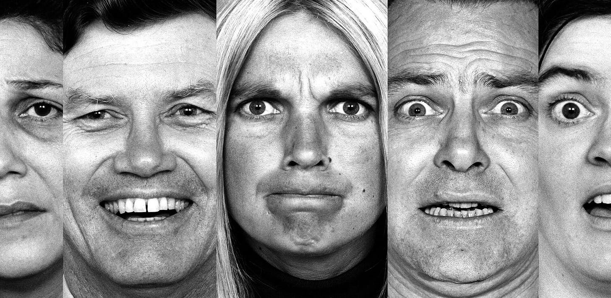

The point is that we are not in absolute control over our emotions, but we can control what construct the emotion operates within or what framework the emotion energizes. 

Of course, I did not come up with this metaphor. It’s sort of tacitly suggested in the colored imagery we routinely apply to color. If you have the blues you are sad, one may be red with anger, the green monster is jealousy. Emotions don’t always make sense but they can always be harnessed for good if we make the effort. And there is no need to say that they can be an excuse for bad behavior and worse. This is the choice we all make. 

Originally published on \[Substack\]\(https://tonyoreglia.substack.com/p/thoughts-on-emotion\)
