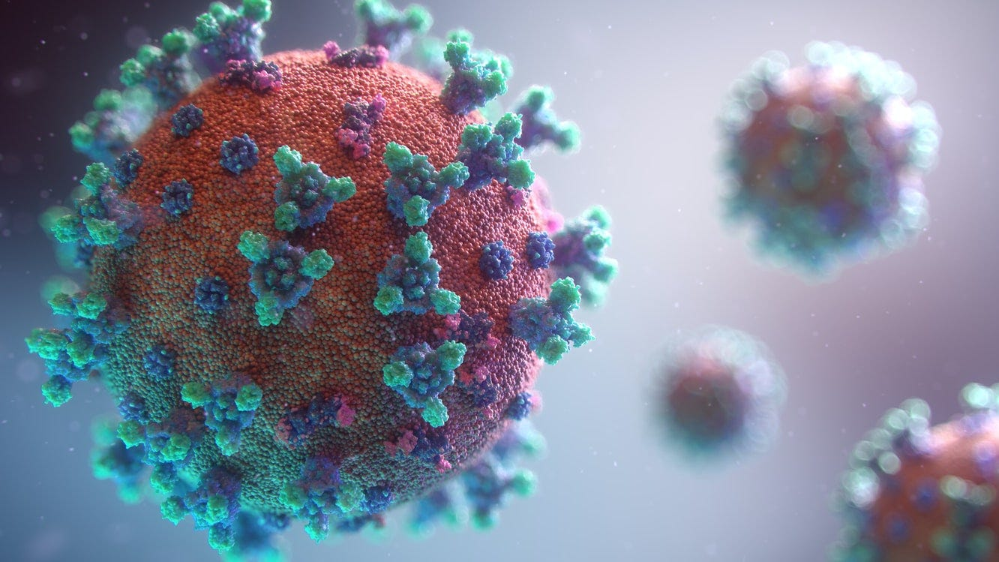
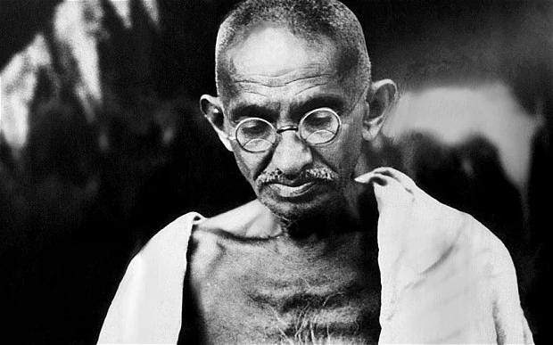
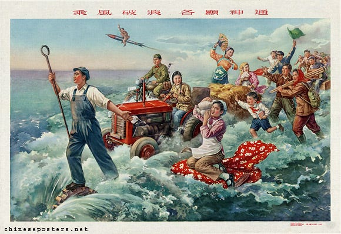

It’s a scary illness. The idea of slowly suffocating alone. This is what got me wondering, what specifically scares me about death? Is it the prerequisite suffering? Is it the unknown? It is difficult to answer because I don’t regularly fear death. The possibility feels distant in the day-to-day run around. 

I wonder if some individuals do not fear death? At times, fearlessness of death is held up as an ideal not easily attainable. For example, religious monks are sometimes pictures as having transcended the fear of death. People do give their lives in the name of a cause. For example, monks burning themselves in protest, Gandhi’s hunger strike, and the 1981 Irish hunger strike. 

Maybe Bobby Sands of the Irish Republic said it best

I don’t think they have found something to fear more than death. Rather, they’ve found something more desirable than life. This infers it’s desired on behalf of others, not oneself. 

We must be very careful in the pursuit of overcoming the fear of death. Believing in something greater than one’s own life is a sort of ego. Finding a purpose this important also means one would judge others’ lives as expendable to the cause. For example, religious crusades or the sacrifices made in the name of socialism like China’s Great Leap Forward resulting in tens of millions of deaths.

Fear of death is natural. It is instinctual. On the other hand, there is a uniquely human aspect in how we conceptualize death. Finding a cause more important than one’s own life is powerful but it may be a force for good or evil. Some give their own life for a righteous cause, others, who subordinate the lives of others, are ultimately after power. 

[1](https://tonyoreglia.substack.com/p/thoughts-on-fear-of-death#footnote-anchor-1-41745137)

https://www.statista.com/statistics/1191568/reported-deaths-from-covid-by-age-us/

Originally published on \[Substack\]\(https://tonyoreglia.substack.com/p/thoughts-on-fear-of-death\)
