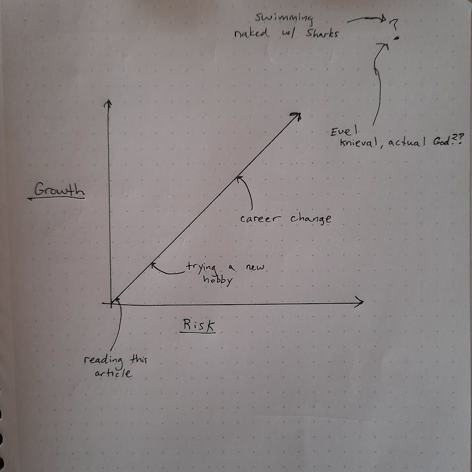
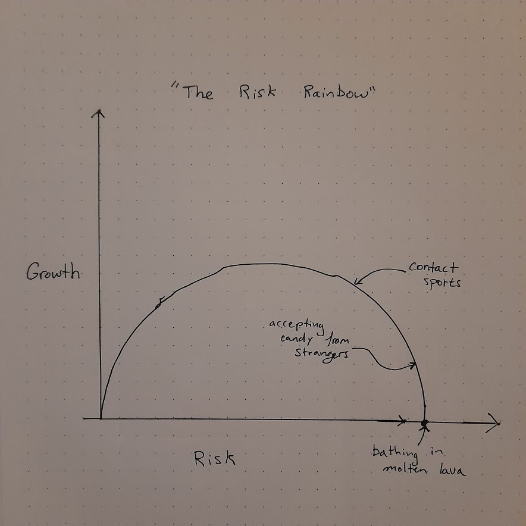

What do I mean by growth? At its core, growth is a reduction in the effort needed to achieve some goal. This reduction is achieved through broadening one’s horizon. Because I’m interested in how choices can improve one’s life, I am specifically focusing on intellectual growth, rather than physical. This is because physical growth is involuntary. 

### Can one grow without risk? 

I think, more subtly, the strict answer is no. Every choice comes with the risk that the choice is suboptimal. So, for example, reading this article might be a way to avoid doing something more important. This choice may be suboptimal, and that risk is run every single time you make a choice. **A choice is actually the elimination of every other possible action one could have taken at that moment**

But this naive question \(can one grow without risk?\) doesn’t really offer much insight. A more interesting way to frame the question is: what is the relationship between risk and growth? 

  * low risk/low growth potential: reading this article

  * higher risk/higher growth potential: writing an article

  * higher risk still/high growth potential: starting a personal blog 

  * and higher: starting a company 

We are in some very subjective water. Now is a good time to define our terms and acknowledge some \(unavoidable?\) subjectivity in this domain.

**Growth** : Reduction in the effort needed to achieve some goal \(e.g. studying javascript to reduce the effort necessary to write useful software thus increasing the ability to be hired as a software developer\). 

Another improvement to this framework would be to consider how the relationship evolves at higher levels of risk. A useful tool when thinking about conceptual relationships is to consider an extreme case. For example, what’s the riskiest choice we could possibly imagine, and what would be the expected growth potential? Obviously, the riskiest choice would be jumping directly into an active volcano. The growth potential is virtually zero. The [Law of Continuity](https://en.wikipedia.org/wiki/Law_of_continuity) suggests that we should expect this terminus to be included in the relationship.

Qualitatively this graph can offer a few simple reminders. Without some level of risk, we cannot grow. On the far left of the graph, there is a higher rate of return on increasing risk. Growth goes up steeply as you shift from no risk to a small amount. Some practical ways to reduce risk are:

In the end, a story is well suited when thinking about ambiguous challenges in life. A child learning to walk clarifies the ideal of growth. As the child learns to walk it will try more objectively risky things like running, jumping, dancing — however, the real risk stays about the same as the skills increase to compensate. Try to be like the child, every day pushing the limit and practicing just beyond the edge of your comfort level. 

Originally published on \[Substack\]\(https://tonyoreglia.substack.com/p/thoughts-on-growth\)
